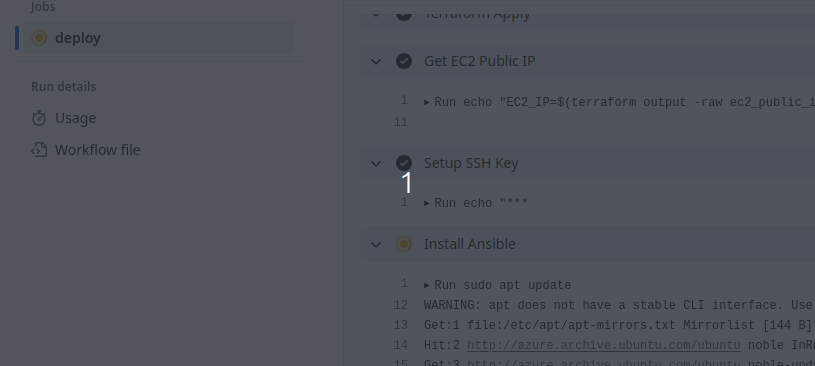
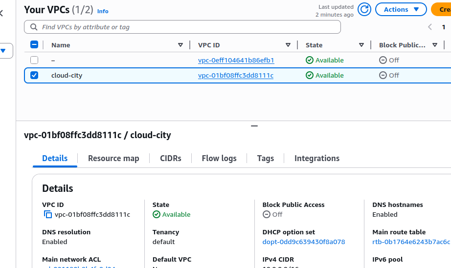
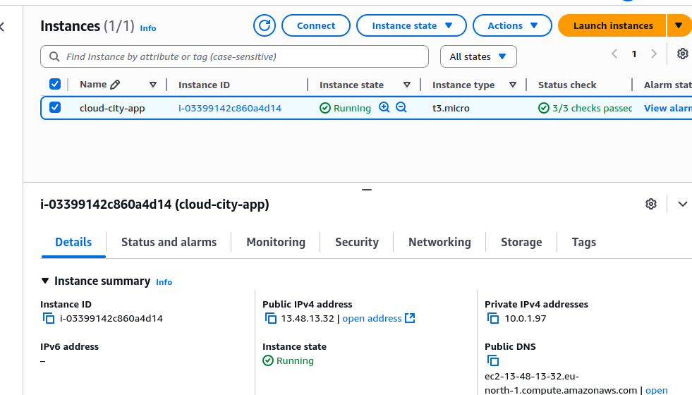
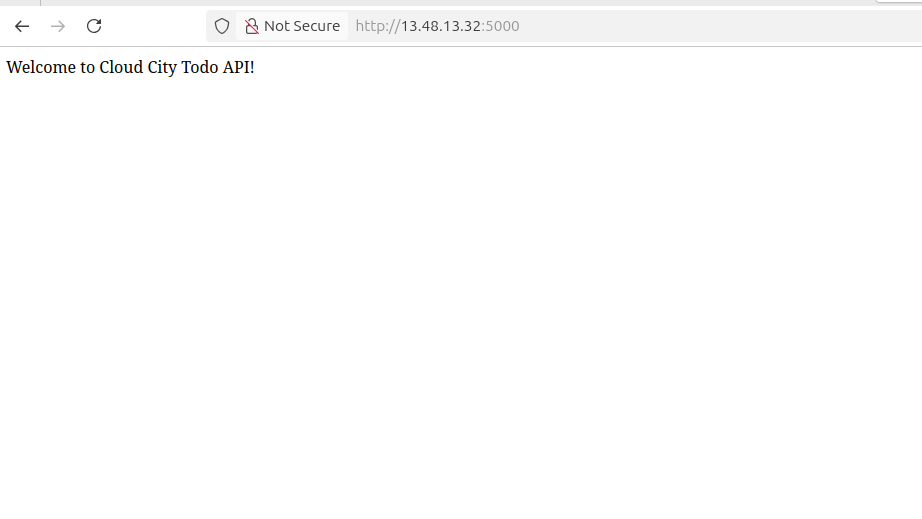
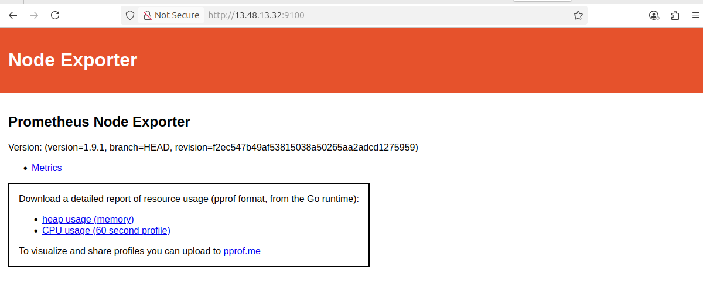
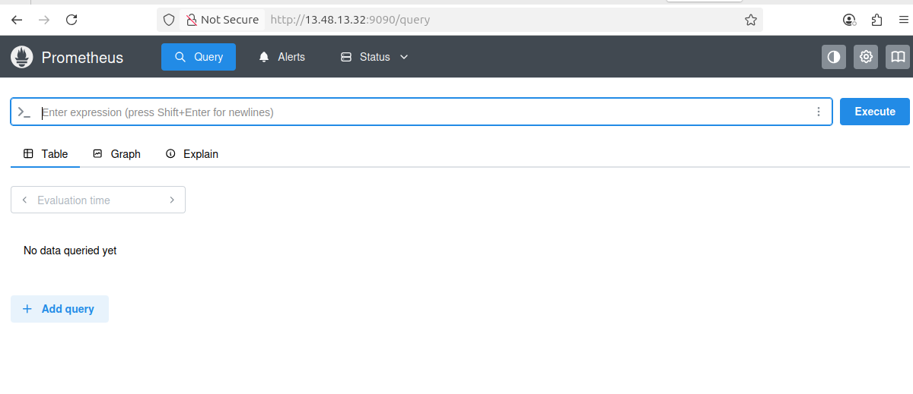
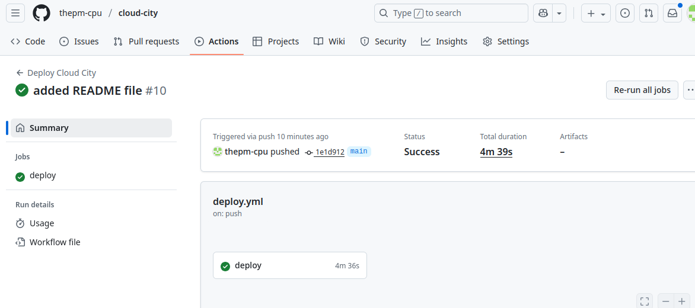

### Cloud City — Automated AWS App Deployment with IaC and Monitoring (TL;DR)
This repo automates provisioning an AWS EC2 instance with Terraform, configures a Python Flask todo API and Prometheus monitoring using Ansible, and deploys via GitHub Actions on push. 
Technologies: AWS, Terraform, Ansible, Prometheus, GitHub Actions.

## Demo / GIF

## Why I built this
To practice end-to-end DevOps: from infra provisioning to app deployment and monitoring in a cloud environment.
Solves learning real-world automation; benefits beginners and job seekers by providing a portfolio-ready, cost-aware demo.

## Architecture
Internet 🌐
  |
Internet Gateway
  |
VPC (eu-north-1)
  ├── Public Subnet
  │   └── EC2 Instance (t3.micro, Ubuntu)
  │       ├── Flask App (port 5000)
  │       ├── Prometheus (port 9090)
  │       └── Node Exporter (port 9100)
  ├── Security Group (inbound: 22, 5000, 9090, 9100)
  └── Route Table (to IGW)

## Quick start (5 steps)
Prereqs: AWS CLI configured, Terraform v1.9+, Ansible, Git, and GitHub repo secrets (AWS keys, SSH private key).
git clone https://github.com/thepm-cpu/cloud-city.git && cd cloud-city
Add GitHub secrets (AWS_ACCESS_KEY_ID, etc.) and push to main—triggers deployment.
How to run tests: Locally, cd terraform && terraform plan; for Ansible, ansible-playbook -i inventory.ini playbook.yml.
How to cleanup: Trigger destroy.yml workflow in GitHub Actions (removes all AWS resources to avoid costs).

## What I implemented
Terraform: VPC, subnet, EC2, security groups with community modules.
Ansible: App deployment (Flask with Gunicorn), Prometheus + Node Exporter setup.
GitHub Actions: Automated deploy/destroy workflows.
Monitoring: Prometheus scrapes app and system metrics.

## What I learned
Dynamic backend config for Terraform in CI/CD to avoid state issues.
Idempotent Ansible roles for reliable configuration.
Debugging service startups (e.g., creating missing dirs for Prometheus).
Importance of public IP for access vs. private IPs.

## Files & structure
terraform/: IaC code (main.tf, modules, etc.).
ansible/: Playbooks and roles (app, monitoring).
app/: Flask code (app.py, requirements.txt).
.github/workflows/: deploy.yml and destroy.yml.
screenshots/: Images for docs.

## CI / Status

## Cost & safety
Warning: Runs a t3.micro EC2 (~$0.01/hr)—always destroy after use. No secrets committed; use GitHub secrets for creds.

## License
MIT

## Contact / Links
LinkedIn: https://www.linkedin.com/in/ossai-chibuzor-0859451ba?
Email: ossaichibuzoralex@gmail.com
 Portfolio: 

## Exact folder structures
cloud-city/
├─ README.md
├─ LICENSE
├─ app/
│  ├─ app.py
│  ├─ requirements.txt
│  └─ gunicorn.conf.py
├─ terraform/
│  ├─ main.tf
│  ├─ variables.tf
│  ├─ outputs.tf
│  ├─ provider.tf
│  └─ modules/  
├─ ansible/
│  ├─ playbook.yml
│  ├─ roles/
│  │  ├─ app/
│  │  │  ├─ tasks/main.yml
│  │  │  ├─ templates/app.service.j2
│  │  │  └─ handlers/main.yml
│  │  └─ monitoring/
│  │     ├─ tasks/main.yml
│  │     ├─ templates/node_exporter.service.j2
│  │     ├─ templates/prometheus.yml.j2
│  │     ├─ templates/prometheus.service.j2
│  │     └─ handlers/main.yml
│  └─ inventory.ini  
├─ .github/
│  └─ workflows/
│     ├─ deploy.yml
│     └─ destroy.yml
├─ screenshots/
│  └─ deployment-demo.gif
├─ docs/
│  └─ arch.png
├─ .gitignore
└─ .terraform.lock.hcl
